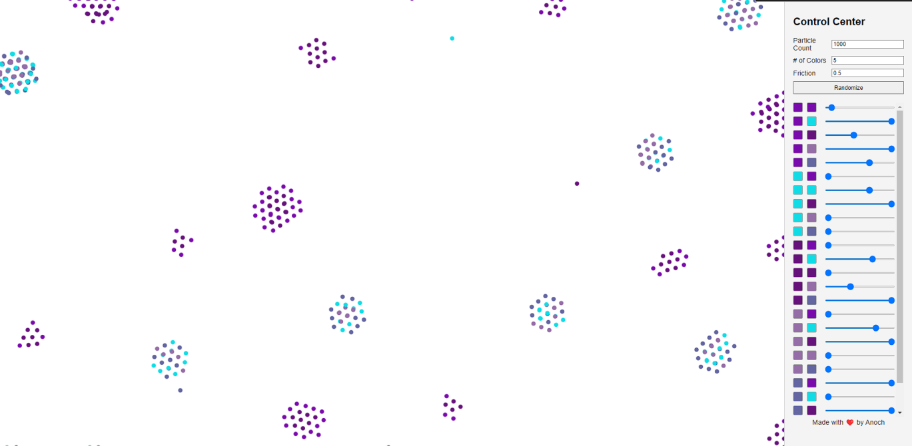
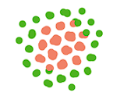
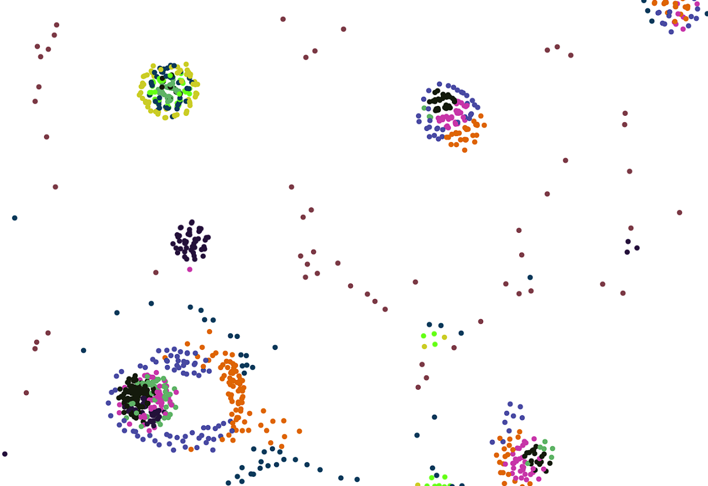

# Particle Life Demo
Particle life is a simple rule-based simulation of atom-like particles. Complex behaviors and structures form from the primitive attraction and repulsion forces. This is my attempt to create a version of it.

[Visit Live Demo](https://itsanoch.github.io/particle-life/)

[I was inspired by Digital Genius's particle life system](https://www.youtube.com/watch?v=4vk7YvBYpOs&t=305s)

## Observations
>Large clumps of particles have formed.

>Particles begin to form a membrane around other particles, similar to real cells and their cell membrane.

>With large particle counts and multiple different colors, more complex structures form. Multi-particle structures that are self-propelled, avoiding other cells and merging/splitting with others.

## Known Issues
- Particles tend to clump together and merge. An attempted solution was to apply strong repulsion when particles are too close, which works but not very effectively.
- Particles jitter, likely a side-effect of the too-close repulsion.
- Particle count is limited; optimization is needed in the future.
- All renditions are unique; they can't be stored or saved. A seed system should be implemented to address this.
